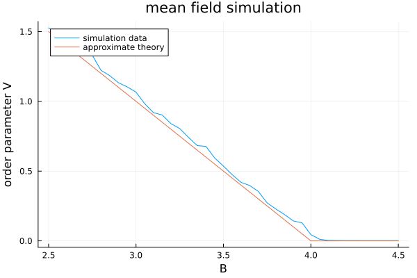

# Temporal criticality

This repository contains the code necessary to reproduce the simulations shown in https://arxiv.org/abs/2309.15070 and discussed in https://arxiv.org/pdf/2307.03546. 


To run this in julia, you need to instantiate the project environment in your REPL. Change directories to `julia_temp_criticality` and run 

```julia

] activate .

```

You can then run the simulations in the jupyter notebook `julia_nb.ipynb`, or you can run the example script `example.jl` from the command line. 

```bash

julia --project example.jl

```

This will save a file `example.png` in the directory with a simulation run, which should look like this:




To compile the C code, used for more heavy computations and in particular the avalanche simulations, `cd` into the `C` directory and run 

```bash
 gcc temporal_avalanches.c -o temporal_avalanches -lm -O2
```

this will create an executable `temporal_avalanches` which you can run with

```bash
./temporal_avalanches
```

which will then store files called `out` (containing the time-series), `avalanches` (containing avalanche sizes), `persistence` (containing the persistence times) and `correlations` (containing the time-series autocorrelation functions) in your working directory.